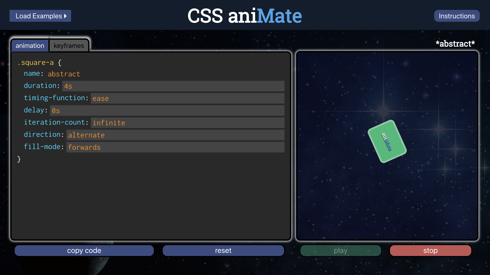
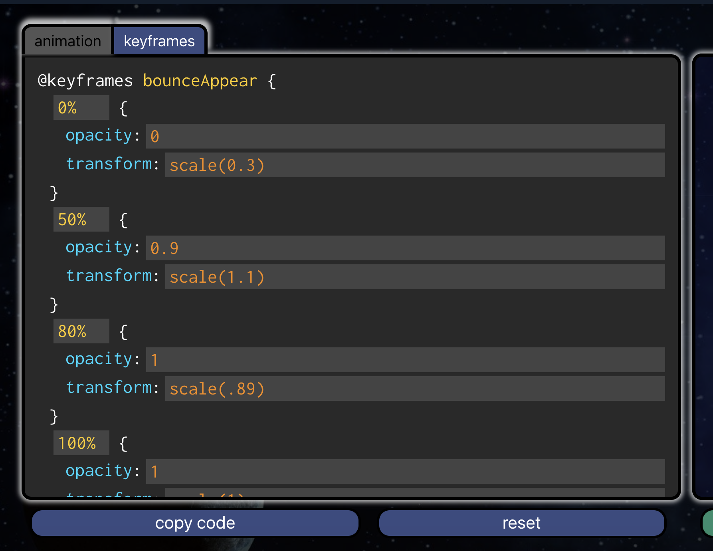

# CSS AniMate

A site for learning, and implementing CSS Animations. Login, Open a predesigned animation or create your own, adjust any of the properties or keyframes as you please, see the effects in real time, then copy the code for personal use!  

### Set Up

Clone this repo. 
Run `npm install` in your terminal

Run the app in the development mode:
Open [http://localhost:3000](http://localhost:3000) to view in the browser.
Run`npm start` in your terminal

### Background / About

CSS animations are an incredible way to give sites a very polished and professional look. Unfortunately many people don't realize just how easy they are to implement. I created CSS Ani-mate to help guide those looking to learn how to use CSS Animations. The app not only provides instructions and guides for how to use keyframes and animations, but also a playground to adjust prebuilt animations and easily copy the code for personal projects. For those already comfortable with CSS animations, users can create an account and create and save their own custom animations. 

### See it Live! 

css-animate.com

### Primary Technologies Used

- ReactJS
- Redux
- React-Router
- Jest/Enzyme
- JSX
- Sass

[BackEnd here](https://github.com/jakelauer27/css-animate-backend)

### Screenshots

